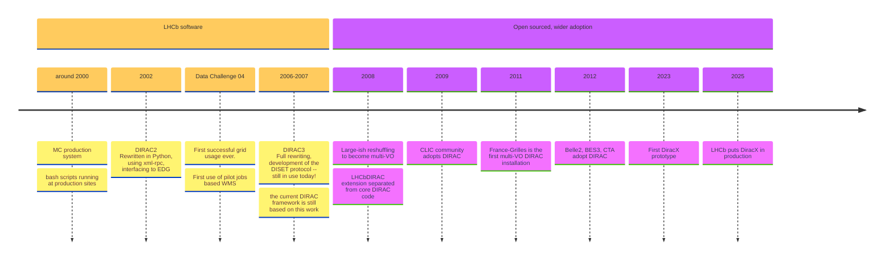
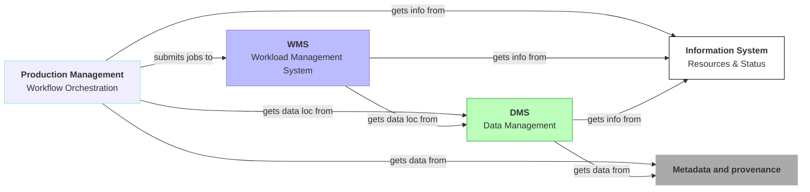
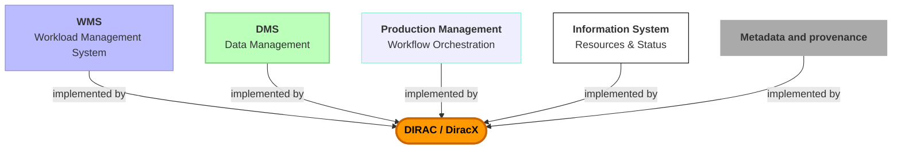
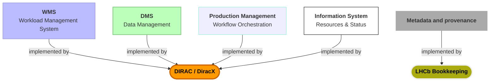
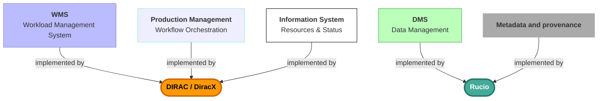
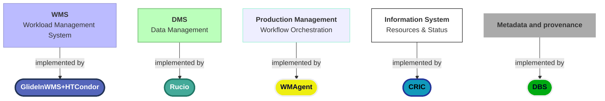
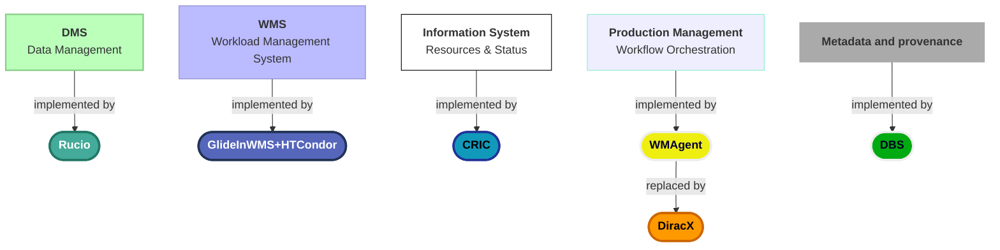
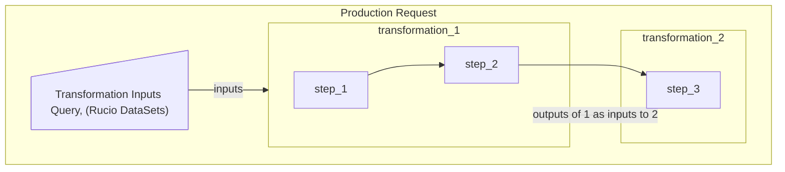
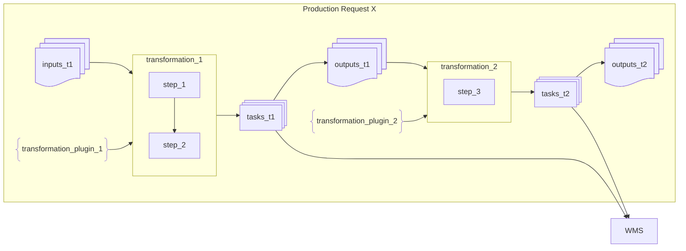

# What is going on with DiracX

 

**Federico Stagni** <Email v="federico.stagni@cern.ch" />

DiracGrid technical coordinator. CERN employee since 2009. Also part of LHCb.

 

21 September 2026
\_\_ <a href="https://indico.cern.ch/event/1612911/#6-dirac-x-plans-and-architectu" class="ns-c-iconlink"><mdi-open-in-new />CMS Autumn O&C Week
</a>

---
layout: section
color: cyan-light
title: Intro
---

# Intro

---
layout: top-title
color: gray-light
align: cm
title: DiracGrid
---

:: title::

# The DiracGrid project

:: content ::

Timeline:

(full history in [this presentation](https://indico.cern.ch/event/1252369/contributions/5515343/attachments/))

Nowadays, the DiracGrid project develops/maintains DIRAC, DiracX, Web, etc... (everything in https://github.com/DIRACGrid).

[diracgrid.org](https://diracgrid.org) is hosting "everything" else you need.

---
layout: top-title-two-cols
color: gray-light
align: c-lm-lm
title: disambiguation
columns: is-4
---

:: title ::

# DIRAC and DiracX

:: left ::

 </img>

- An "interware" (a tool for doing distributed computing)
- Today is used **in production** by few dozens communities
- It can be used for managing jobs (via pilots), data, productions (workflows), dataset transfers, etc

:: right ::

 </img>

- "The neXt DIRAC incarnation", a complete rewrite aiming at fully replacing DIRAC. A cloud native app, multi-VO from the get-go, standards-based. [CHEP24 presentation](https://indico.cern.ch/event/1338689/contributions/6010971/).
  - Younger, faster, better, stronger.
- Used **in production** by LHCb, with few others getting there.
- Right now it can do few things, with the bulk of the operations still done by DIRAC.

<AdmonitionType type='important' >
A DIRAC++, in terms of functionalities.
</AdmonitionType>

---
layout: top-title-two-cols
color: gray-light
align: cm-lm-lm
title: who
---

:: title ::

# Users, and consortium

:: left ::

- Multi-VO installation:
  - GridPP
  - EGI
  - IHEP (Juno)
  - JINR
  - France-Grilles
  - CLIC (including FCC)

- Single-VO installations:
  - LHCb
  - CTAO
  - Belle2

:: right ::

## Legally

The [**DIRAC Consortium**](https://diracgrid.org/consortium.html) was created in February 2014 to support development and promotion of the DIRAC software.

 

Dirac is an [HSF affiliated project](https://hepsoftwarefoundation.org/projects/projects.html).

---
layout: top-title
color: gray-light
align: c
title: core-functionalities
clicks: 5
---

:: title ::

## Core functionalities and tools (enormous simplification)

:: content ::

<v-switch>
<template #0>

### **Core functionalities**

 

 
 

### **Tools** (subset of the existing ones)

 

</template>
<template #1>

# **JUNO**

 
 
 
 

</template>
<template #2>

# **LHCb**

 
 
 
 

</template>
<template #3>

# **Belle2**, **CTAO**, and **FCC**

 
 
 
 

</template>
<template #4>

# **CMS**

 
 

</template>
<template #5>

# **CMS**

 
 

<SpeechBubble position="r" color='amber' shape="round"  v-drag="[200,320,400,120]">
I am here because CMS reviewed Dirac and chose it as its Workflow Management of choice for Run4.
</SpeechBubble>

</template>
</v-switch>

---
layout: top-title
color: gray-light
align: cm
title: whodoeswhat
---

:: title ::

# Users, VOs (communities), admins, developers, and coordinator(s)

:: content ::

- The end **users** are VOs users. Admins of the DIRAC/DiracX installations engage with them.
- A single DIRAC/DiracX installation can be used by several **VOs**.
  - EGI, GridPP, and other DIRAC installations are each used by a dozen VOs.
- Each installation has **admins** taking care of installations/updates etc. They are not necessarily the main operators of the installation (which are normally part of a VO).
- **Developers** are whoever care about developing and maintaining the system.
  - Members of LHCb, CTAO, GridPP, EGI, Belle2, FG, ILC, FCC **and now CMS** all contributes or have contributed to it
  - LHCb maintains the highest concentration of core developers
- Current **coordinators** are Andrei Tsaregorodtsev (mostly non-technical) and Federico Stagni (technical). (re-)Elections happen every 2 years.

---
layout: top-title
color: gray-light
align: cm
title: devflow
---

:: title ::

# Developers' view: typical features' development flow

:: content ::

We use SCRUM.

1. The **Product Owner(s)** send a mail to diracproject-admins@cern.ch about topic X (anyone in the ML is effectively a product owner).
2. The technical coordinator collects/arranges the **user stories** which can be written down in an "epic" issue on GitHub.
3. Core developers write down Architecture Design Records (ADR).
4. (Core) developers propose a **development plan** (on github), with follow-up on GitHub and/or in meetings.
5. **Tasks** are written. Coding starts. Anyone in the developers' pool can take up (or asked to take up) any of the tasks.
6. Follow-ups in [this board](https://github.com/orgs/DIRACGrid/projects/30/views/1), 2-weeks-long sprints. Checkpoint meetings every Thursday.
7. System tests can be done on the [Dirac certification setup](https://github.com/DIRACGrid/DIRAC/wiki/Certifications).

---
layout: section
color: cyan-light
title: Dirac(X) and Workflows
---

# Dirac(X) and Workflows
## (the "Production System")

---
layout: top-title
color: gray-light
align: cm
title: Concepts
---

:: title ::

# DIRAC Concepts

:: content ::

| **Dirac Name** | **AKA** | **Description** | **Example** |
|------------|----------------|-------------|---------|
| Production Request | Workflow | A full fledged processing, with several definitions of payloads | DataReconstruction |
| Transformation | Work Queue Unit | A unit of the production request, each might run more then 1 payload definition | Merge |
| Transformation Inputs | Rucio Container | The list of LFNs in input to a transformation | `[lfn_1, lfn_2, ... , lfn_534]` |
| Transformation Plugin | ? | The policy for creating tasks | ByRun |
| Task | | A proto-job, pushed to the WMS | Type:`Merging`,Inputs:`[lfn_1, lfn_2]`,Payload_id:`123` | 

---
layout: top-title
color: gray-light
align: cm
title: PMS
---

:: title ::

## DIRAC Production Requests

container of steps

:: content ::

With a *step* being the description of a payload (which application, version, options, ...)

 
 

---
layout: top-title
color: gray-light
align: cm
title: WFS
---

:: title ::

# Putting everything together

:: content ::

- DIRAC's transformations can be chained one to the other
- The DIRAC production system links them together
- DiracX "Production System" will be an evolution of the DIRAC's one

---
layout: top-title
color: gray-light
align: cm
title: WFS-VO
---

:: title ::

# The VO's policies 

:: content ::

A very important concept of DIRAC is its extensibility. Its primary goal is to accommodate VO specificities.

There are VO specific policies.
VO specific policies descend for VO specific concepts, e.g. a physics "fill", or "run", or "portion of the sky". They *should* live in a VO extension.

Examples:
- Pretty much everything through which you describe your data, and that you want to use for creating tasks through transformation plugins
- Workflow modules (you want your jobs to run something specific before, during or after the payloads)
- Access to specific services or databases

---
layout: section
color: lime-light
---

    
    -->
    

---
layout: top-title
color: gray-light
align: c
title: points
---

:: title ::

# Notable points

:: content ::

DiracX is developed on a daily base.

So is DIRAC, but for DIRAC we do only fixes, and minor features. 

 
 

<AdmonitionType type='note' >
There are several communities using DIRAC right now. Their business continuity is our top priority.
</AdmonitionType>

<AdmonitionType type='important' >
DIRAC and DiracX will live together for a while
</AdmonitionType>

<AdmonitionType type='info' >
One functionality at a time, we'll eventually migrate all from DIRAC to DiracX.
</AdmonitionType>

<SpeechBubble position="t" color='cyan' shape="round"  v-drag="[300,415,550,60]">
The priorities for the developments are discussed collectively
</SpeechBubble>

---
layout: top-title
color: gray-light
align: c
title: FAQ
---

:: title ::

# Status of DIRAC to DiracX migration 

:: content ::

 
- Nowadays, what's DiracX used for?

DiracX currently handles few notable tasks for which scalability was a concern in DIRAC.

 
- Can I use DiracX without DIRAC?

ATM, no, simply because DiracX has few features at the moment, and those are there to work together with DIRAC. 
DiracX can "start", its REST APIs would be responding to queries, all underpinnings ready...

 
- When will it work without DIRAC?

...It depends! from what you want it to do.

 
- What about the DiracX Productions (the "Workflow Orchestration" system)?

In development. And yes, this in an opportunity!

---
layout: top-title
color: gray-light
align: cm 
title: DiracXWMS
---

:: title ::

# CWL for DiracX

:: content ::

  
  
  

We have been recently tested the first [CWL jobs](https://github.com/DIRACGrid/diracx/issues/858). Next, we will look into describing `Transformation` and `Production` through CWL hints.

<SpeechBubble position="t" color='light-red' shape="round"  v-drag="[400,440,480,90]">
  Main involvements: LHCb, CTAO. CMS should likely get involved here ASAP (now, effectively).
</SpeechBubble>

---
layout: iframe-right
title: extesion
url: https://diracx.diracgrid.org/en/latest/dev/explanations/extensions/
class: webAPI
slide_info: false
color: gray-light
align: lm
---

# DiracX extensions

A very important concept also for DiracX is its extensibility. Full documentation on the left (pointing [here](https://diracx.diracgrid.org/en/latest/dev/explanations/extensions/))!

We provide a reference implementation of an extension (dubbed "Gubbins").

---
layout: top-title-two-cols
align: cm-cm-lm
color: orange-light
columns: is-3
title: summary
--- 
:: title ::

# Summary

:: left :: 

:: right ::

In general, DIRAC has a very active community of users and developers.

- DiracX is "the neXt Dirac incarnation", ensuring the future of the widely used DIRAC.
  - It will live together with DIRAC v9 for a while, until it will replace it completely
  - It's developed by a superset of the current DIRAC developers

---
layout: credits
color: navy
loop: true
speed: 1.0
title: credits/people
---

    

        <strong>People</strong> 
    

    

        <strong>Current Developers, maintainers, supporters (non-exhaustive list)</strong>
    

    

        Chris Burr <i>CERN, LHCb</i> 
        Christophe Haen <i>CERN, LHCb</i> 
        Alexandre Boyer <i>CERN, LHCb</i> 
        Natthan Piggoux <i>LUPM (FR), CTAO</i> 
        Cedric Serfon <i>Brookhaven National Laboratory (US), Belle2</i> 
        Ryunosuke O'Neil <i>CERN, LHCb</i> 
        Daniela Bauer <i>Imperial collegOe (UK), GridPP</i> 
        Simon Fayer <i>Imperial college (UK), GridPP</i> 
        Janusz Martyniak <i>Imperial college (UK), GridPP</i> 
        Xiaomei Zhang <i>Beijing, Inst. High Energy Phys. (CN), Juno</i> 
        Luisa Arrabito <i>LUPM (FR), CTAO</i> 
        André Sailer <i>CERN, ILC</i> 
        Jorge Lisa Laborda <i>Univ. of Valencia and CSIC (ES), LHCb</i> 
        Bertrand Rigaud <i>IN2P3 (FR), France-Grilles</i> 
        Heloise Joffe <i>IN2P3 (FR), France-Grilles</i> 
        Stella Maria Renucci <i>LUPM (FR), CTAO</i> 
        Mazen Ezzeddine <i>CPPM (FR), EGI</i> 
        Loris vankatwijk <i>LUPM (FR), CTAO</i>
    

    

        <strong>Project lead</strong>
    

    

        Federico Stagni <i>CERN, LHCb</i> 
        Andrei Tsaregorotsev <i>CPPM (FR), EGI, LHCb, Juno</i>
    

&nbsp;
&nbsp;
&nbsp;
&nbsp;
&nbsp;

    <strong>Questions?</strong>

---
layout: section
color: cyan-light
title: Backup
---

# Backup

---
layout: top-title
color: gray-light
align: c
title: integration
---

:: title ::

# How DIRAC and Rucio work together

:: content ::

The entry point is the DIRAC's `RucioFileCatalog`, which is an implementation of the `FileCatalog` "abstract" class (DIRAC has few different implementation of the same class, and you can `register_file()` to more than 1 catalog at the same time)
- in DIRAC since 2021
- by now it supports *Multi VO* and *Rucio metadata*
- The synchronization between DIRAC and Rucio is done via DIRAC
agents

Once the data is in the Rucio catalog, all the replication policies, 3rd party copy are handled by Rucio subscriptions and rules. 

This also means that:
- Admins still updates the DIRAC configuration
- No change for the download/upload from jobs: still done via the DIRAC's `DataManager`

---
layout: top-title
color: gray-light
align: c
title: namespace
---

:: title ::

# How DIRAC and Rucio work together -- namespace

:: content ::

- By default, Rucio has a flat namespace that contains files
  - Files that can be aggregated to datasets
  - Then datasets can be aggregated to container
- DIRAC uses a hierarchical namespace

The `RucioFileCatalog` "translates" from DIRAC to Rucio's namespace. All details in [this vCHEP presentation](https://indico.cern.ch/event/948465/contributions/4323983/attachments/2247115/3811355/The%20Rucio%20File%20Catalog%20in%20Dirac%20implemented%20for%20Belle%20II-2.pdf)

